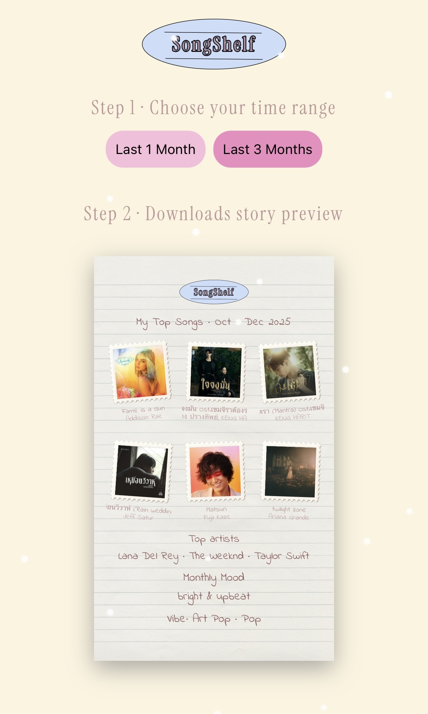
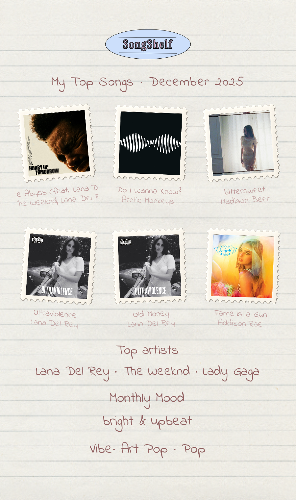

# SongShelf

SongShelf turns your Spotify listening history into a scrapbook-style story image. It shows your top 6 songs as postage stamps, your top artists, a "monthly mood" and your main genres, ready to download and post to Instagram Stories.

**Live site:** https://songshelf.app

<p align="center">
  
  &nbsp;&nbsp;
  
</p>

<p align="center">
  <em>Left: the app screen. Right: the story image you download.</em>
</p>

---

## Table of contents

1. [Features](#features)
2. [Tech stack](#tech-stack)
3. [How it works](#how-it-works)
4. [Requirements](#requirements)
5. [Step-by-step setup](#step-by-step-setup)
6. [Using the app](#using-the-app)
7. [Project structure](#project-structure)
8. [Environment variables](#environment-variables)
9. [Backend API](#backend-api)
10. [Customizing](#customizing)
11. [Troubleshooting](#troubleshooting)
12. [Deploying](#deploying)
13. [Contributing](#contributing)
14. [License](#license)

---

## Features

- Log in with your Spotify account
- Choose a time range: **Last 1 Month** or **Last 3 Months**
- Top 6 songs shown as postage stamps with cover art, song name and artist
- Top artists of the period
- A "monthly mood" worked out from the genres you listen to
- Your top genres ("vibe")
- Download the story as a PNG, with the paper background or with a transparent background

## Tech stack

| Part      | Technology                                  |
| --------- | ------------------------------------------- |
| Frontend  | React 18, Vite 5, html2canvas               |
| Backend   | Node.js, Express 5, Axios                   |
| APIs      | Spotify Web API                             |
| Hosting   | Vercel (frontend), any Node host (backend)  |

## How it works

```
 Browser (React)            Backend (Express)              Spotify
 ---------------            -----------------              -------
 1. Click "Log in"  ----->  GET /login  ---------------->  Spotify login page
                                                             |
 3. Receives token  <-----  GET /callback  <---------------  2. User approves
    in the URL              (swaps code for access token)
                                                             
 4. GET /top-tracks ----->  calls /v1/me/top/tracks  ---->  returns top songs
 5. Calls /v1/me/top/artists directly with the token  --->  returns top artists
 6. Builds the story and turns it into a PNG in the browser
```

The Spotify **Client Secret** stays on the backend only. The browser never sees it.

---

## Requirements

Before you start, make sure you have:

- **Node.js 18 or newer.** Check by running `node -v` in a terminal. If it is missing, install the LTS version from https://nodejs.org
- **npm** (installed together with Node.js). Check with `npm -v`
- **Git.** Check with `git --version`. Install from https://git-scm.com if needed
- **A Spotify Premium account** for whoever creates the Spotify developer app (Step 3). Since February 2026, Spotify requires the app owner to have an active Premium subscription, otherwise the app stops working. People who only log in to use SongShelf do not need to be the owner.

---

## Step-by-step setup

### Step 1: Get the code

Open a terminal and run:

```bash
git clone https://github.com/urmxrainbow/songshelf.git
cd songshelf
```

If you do not use Git, you can also click the green **Code** button on GitHub, choose **Download ZIP**, unzip it and open a terminal in that folder.

### Step 2: Install dependencies

```bash
npm install
```

This creates a `node_modules` folder. It can take a minute.

### Step 3: Create a Spotify developer app

SongShelf needs its own Spotify "app" to be allowed to read listening data.

1. Go to https://developer.spotify.com/dashboard and log in with your Spotify account.
2. Click **Create app**.
3. Fill in the form:
   - **App name:** `SongShelf (local)` or any name you like
   - **App description:** anything, for example `Local test of SongShelf`
   - **Redirect URIs:** type `http://127.0.0.1:4000/callback` and click **Add**
   - **Which API/SDKs are you planning to use?** tick **Web API**
4. Accept the terms and click **Save**.
5. On your new app's page, click **Settings**. Copy the **Client ID**. Click **View client secret** and copy the **Client Secret**.
6. Open the **User Management** tab and add the name and email of every Spotify account that will log in, including your own.

> **Why step 6?** New Spotify apps start in *Development mode*, which only allows users you add by hand. Apps created after February 11, 2026 can have at most **5 users**. Anyone not on that list will see a "not allowed" message after logging in.

> **Note:** Spotify no longer accepts `localhost` in redirect URIs. Use `127.0.0.1` exactly as written above.

### Step 4: Create your `.env` file

Copy the example file:

```bash
cp .env.example .env
```

On Windows (Command Prompt) use `copy .env.example .env` instead.

Open `.env` in a text editor and fill in the values:

```env
SPOTIFY_CLIENT_ID=paste_your_client_id_here
SPOTIFY_CLIENT_SECRET=paste_your_client_secret_here
SPOTIFY_REDIRECT_URI=http://127.0.0.1:4000/callback

FRONTEND_URL=http://127.0.0.1:5173
VITE_BACKEND_URL=http://127.0.0.1:4000

PORT=4000
```

> Never commit your `.env` file. It is already listed in `.gitignore`.

### Step 5: Start the backend

In your first terminal:

```bash
node server.js
```

You should see:

```
Spotify server running at:
http://localhost:4000
```

Leave this terminal open.

### Step 6: Start the frontend

Open a **second** terminal in the same folder and run:

```bash
npm run dev -- --host 127.0.0.1
```

You should see something like:

```
  VITE v5.x  ready in 300 ms
  ->  Local:   http://127.0.0.1:5173/
```

### Step 7: Open the app

Go to **http://127.0.0.1:5173** in your browser.

Use `127.0.0.1`, not `localhost`. They have to match the values in your `.env`, or login and CORS will fail.

---

## Using the app

1. Click **Log in with Spotify**.
2. Spotify asks you to allow SongShelf to see your top artists and songs. Click **Agree**.
3. You are sent back to SongShelf.
4. **Step 1 - Choose your time range:** pick **Last 1 Month** or **Last 3 Months**.
5. **Step 2 - Story preview:** your story builds itself on the lined paper. It shows:
   - your top 6 songs as stamps
   - your top artists
   - your monthly mood
   - your vibe (top genres)
6. Click **Download PNG (with paper)** to save the story with the paper background, or **Download PNG (transparent)** to save it with a clear background.
7. Post it to your Instagram Story or anywhere you like.

---

## Project structure

```
songshelf/
├── server.js                  Express backend (Spotify login + API proxy)
├── index.html                 HTML page that loads the React app
├── package.json               Dependencies and npm scripts
├── .env.example               Template for your secret settings
├── preview01.jpg              Screenshot used in this README
├── preview02.PNG              Screenshot used in this README
├── assets/
│   ├── logo.svg               SongShelf logo
│   ├── stamp-frame.png        Stamp border around each cover
│   ├── story-paper.png        Lined paper background
│   └── loader/                Loading animation frames
└── src/
    ├── main.jsx               React entry point
    ├── App.jsx                Main screen: time range, story, download
    ├── App.css                Main styles and fonts
    ├── login.jsx              Standalone login screen (not used by App.jsx)
    └── fonts/                 Web fonts (Indie Flower, Instrument, Kapakana)
```

---

## Environment variables

| Name                    | Required | Used by  | What it is                                                         |
| ----------------------- | -------- | -------- | ------------------------------------------------------------------ |
| `SPOTIFY_CLIENT_ID`     | Yes      | Backend  | Client ID from your Spotify app                                    |
| `SPOTIFY_CLIENT_SECRET` | Yes      | Backend  | Client Secret from your Spotify app                                |
| `SPOTIFY_REDIRECT_URI`  | Yes      | Backend  | Must exactly match a Redirect URI in your Spotify app settings     |
| `FRONTEND_URL`          | Yes      | Backend  | Where users go after login. Also allowed through CORS              |
| `VITE_BACKEND_URL`      | Yes*     | Frontend | Address of the backend. *If empty, the live `api.songshelf.app` is used |
| `PORT`                  | No       | Backend  | Backend port. Default `4000`                                       |

Variables that start with `VITE_` are built into the frontend and are visible to anyone. Never put secrets in a `VITE_` variable.

---

## Backend API

| Method | Path              | Description                                                                                  |
| ------ | ----------------- | -------------------------------------------------------------------------------------------- |
| GET    | `/login`          | Redirects to Spotify's login page with the `user-top-read` scope                              |
| GET    | `/callback`       | Spotify returns here. Swaps the code for an access token and redirects to `FRONTEND_URL?access_token=...` |
| GET    | `/top-tracks`     | Returns the user's top 6 tracks. Needs header `Authorization: Bearer <token>`. Query: `time_range=short_term` or `medium_term` |

---

## Customizing

**Change how the monthly mood is chosen.** Edit `getMoodFromGenres()` in `src/App.jsx`:

```js
if (text.includes("dream")) return "dreamy & dramatic";
if (text.includes("indie")) return "indie & introspective";
if (text.includes("pop"))   return "bright & upbeat";
if (text.includes("rock"))  return "intense & energetic";
```

Add your own rules, for example `if (text.includes("jazz")) return "smooth & mellow";`. Rules higher up are checked first.

**Show more or fewer songs.** Change `limit: 6` in the `/top-tracks` route in `server.js`.

**Add a time range.** Spotify also supports `long_term` (about 1 year). Add a button in `App.jsx` and map it in `mapRangeToTimeRange()`.

**Change the look.** Replace `assets/story-paper.png`, `assets/stamp-frame.png` or the fonts in `src/App.css`.

---

## Troubleshooting

| Problem | Fix |
| ------- | --- |
| `INVALID_CLIENT: Invalid redirect URI` | The `SPOTIFY_REDIRECT_URI` in `.env` must match the one in your Spotify dashboard exactly, including `http`, `127.0.0.1`, port and `/callback`. |
| Login works but no songs appear / 403 error | Your Spotify account is not in **User Management** in the Spotify dashboard. Add it (Step 3.6). |
| `Not allowed by CORS` in the backend terminal | `FRONTEND_URL` in `.env` must match the address in your browser exactly. Use `127.0.0.1`, not `localhost`. Restart `node server.js` after changing `.env`. |
| App still talks to `api.songshelf.app` | `VITE_BACKEND_URL` is missing from `.env`. Add it and restart `npm run dev`. |
| `Missing authorization code` | Open the app from the start page and click Log in again instead of opening `/callback` directly. |
| `Error: Cannot find module 'express'` | Run `npm install` again. |
| Port 4000 or 5173 already in use | Stop the other program, or change `PORT` (and the matching URLs) in `.env`. |
| It worked before, but now loading fails after a while | Spotify access tokens expire after 1 hour. Refresh the start page and log in again. |
| The app suddenly stops working for everyone | The Spotify app owner's Premium subscription has lapsed. Renew it, or create the Spotify app with a Premium account. |
| `429` error with `QUOTA_EXCEEDED` | Your Spotify developer account hit its Development mode quota. Wait and try again later. |
| A friend cannot log in | Add their Spotify email under **User Management** (max 5 users for new apps). |

---

## Deploying

A typical setup is:

1. **Backend:** deploy `server.js` to a Node host (Render, Railway, Fly.io or a VPS). Add all backend variables from the table above in the host's settings.
2. **Frontend:** deploy to Vercel or Netlify. Build command `npm run build`, output folder `dist`. Set `VITE_BACKEND_URL` to your backend's public URL.
3. In the Spotify dashboard, add your production redirect URI, for example `https://api.your-domain.com/callback`, and set `SPOTIFY_REDIRECT_URI` to the same value.
4. Set `FRONTEND_URL` on the backend to your frontend's public URL.
5. Your deployed copy is still in Spotify *Development mode*, so only the users you add under **User Management** can log in (max 5 for new apps). Spotify's **Extended Quota Mode**, which removes this limit, is only open to registered businesses with a launched service and at least 250,000 monthly active users.

---

## Contributing

Contributions are welcome.

1. **Fork** this repository (button at the top right on GitHub).
2. Clone your fork: `git clone https://github.com/<you>/songshelf.git`
3. Create a branch: `git checkout -b feature/my-change`
4. Make your changes and test them locally (see setup above).
5. Commit: `git commit -m "Describe your change"`
6. Push: `git push origin feature/my-change`
7. Open a **Pull Request** on GitHub and describe what you changed and why.

For bigger changes, please open an **Issue** first so we can talk about it.

Ideas for contributions:

- More mood rules or a smarter mood algorithm
- A "Last 1 Year" option
- New story themes and layouts
- Better mobile layout
- Translations

---

## License

Released under the [MIT License](LICENSE). You are free to use, change and share this code.

SongShelf is not affiliated with or endorsed by Spotify. Spotify is a trademark of Spotify AB. Album artwork belongs to its respective owners.
